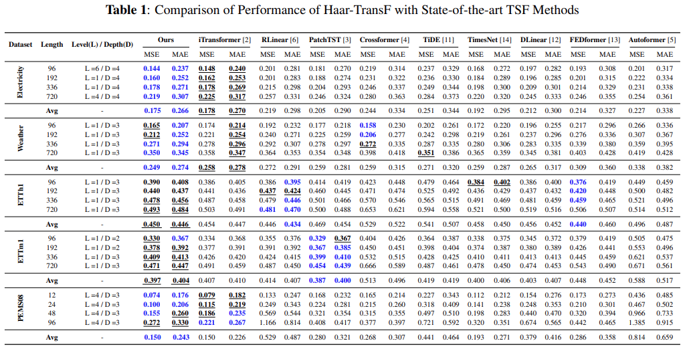
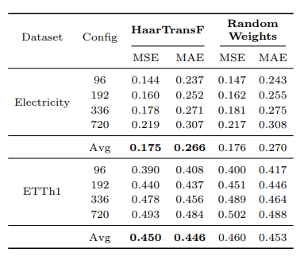

# Harnessing-Learnable-Wavelets-A-Lightweight-and-Effective-Model-for-Time-Series-Forecasting
Code will be released soon..!!

## 1. Comparisons with DLinear and TiDE have now been added into Table 1

  

## 2. Ablations

### An ablation study on the MSHT block is initialized with random weights versus the trainable MSHT .

  

### An ablation study on the MSHT block is initialized with fixed coefficients versus the trainable MSHT .

  

