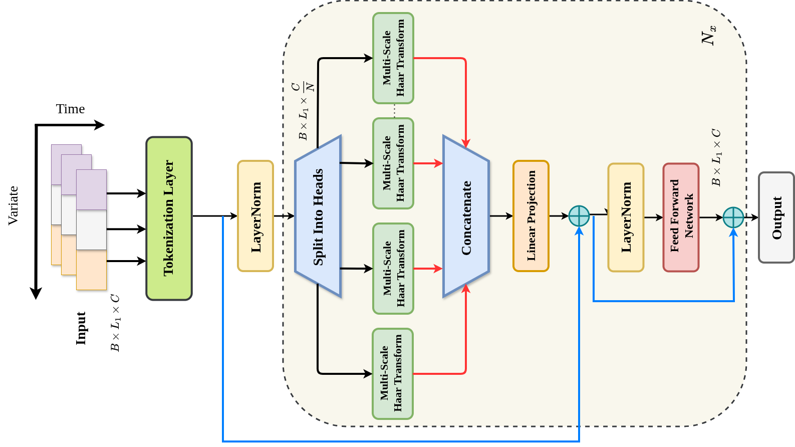
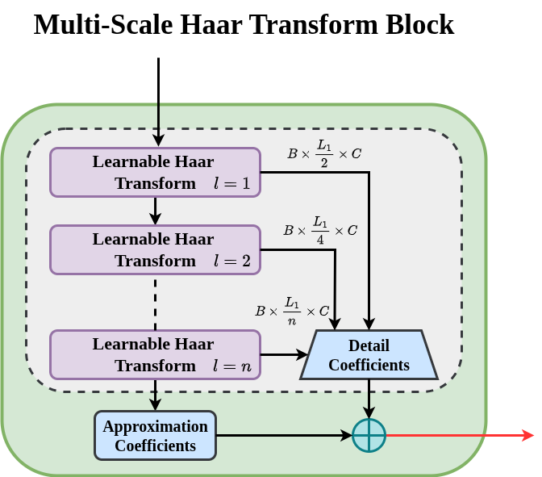
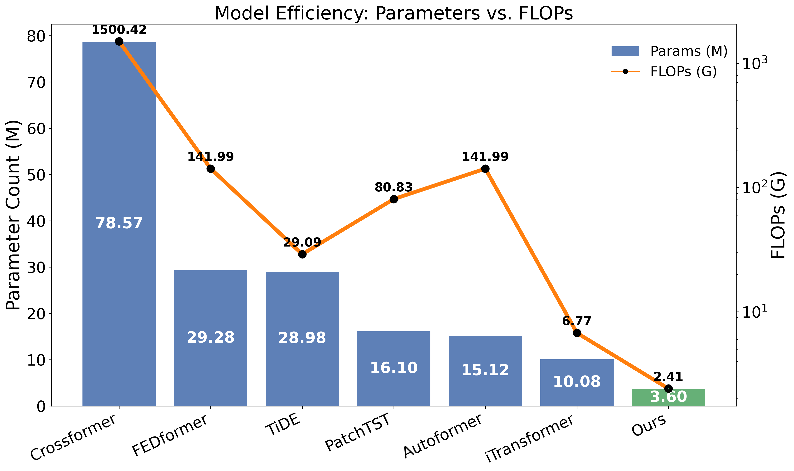
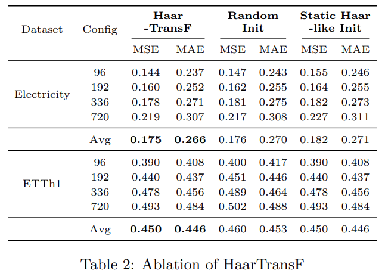

# Harnessing-Learnable-Wavelets-A-Lightweight-and-Effective-Model-for-Time-Series-Forecasting
Code will be resealing soon..!!


## Abstract
Time series forecasting requires models that can efficiently capture complex temporal dependencies, especially in large-scale and high-dimensional settings.~While Transformer-based architectures excel at modeling long-range dependencies, their quadratic computational complexity poses limitations on scalability and adaptability. To address these challenges, we propose a lightweight model named Haar-TransF, a novel Transformer-inspired architecture that replaces the self-attention module with a learnable Multi-Scale Haar Transform (MSHT) block. The MSHT block, equipped with trainable low- and high-pass haar like filter coefficients, efficiently captures multi-scale approximation and detail components, effectively encoding periodic patterns while suppressing noise, thereby enhancing the modeling of correlations across multiple time series in forecasting tasks. Extensive experiments on several standard forecasting benchmarks demonstrate that Haar-TransF achieves superior predictive accuracy to conventional Transformer-based models, while substantially reducing memory usage for the time series forecasting task.~The obtained experimental results position Haar-TransF as a scalable and resource-efficient framework for advanced time series forecasting.

## 1. Proposed Framework


*Figure 1 (a): Overview of the proposed Haar-TransF architecture.*

<p align="center">
  
</p>
Figure 1 (b): Overview of the proposed Multi-scale Haar Transform architecture.

### Train and evaluate

```bash
# ECL
bash ./scripts/multivariate_forecasting/ECL/HaarTransF.sh
# Exchange
bash ./scripts/multivariate_forecasting/Exchange/HaarTransF.sh
# Traffic
bash ./scripts/multivariate_forecasting/Traffic/HaarTransF.sh
# Weather
bash ./scripts/multivariate_forecasting/Weather/HaarTransF.sh
# Solar-Energy
bash ./scripts/multivariate_forecasting/SolarEnergy/HaarTransF.sh
# PEMS
bash ./scripts/multivariate_forecasting/PEMS/HaarTransF_03.sh
bash ./scripts/multivariate_forecasting/PEMS/HaarTransF_04.sh
bash ./scripts/multivariate_forecasting/PEMS/HaarTransF_07.sh
bash ./scripts/multivariate_forecasting/PEMS/HaarTransF_08.sh
# ETT
bash ./scripts/multivariate_forecasting/ETT/HaarTransF_ETTm1.sh
bash ./scripts/multivariate_forecasting/ETT/HaarTransF_ETTm2.sh
bash ./scripts/multivariate_forecasting/ETT/HaarTransF_ETTh1.sh
bash ./scripts/multivariate_forecasting/ETT/HaarTransF_ETTh2.sh
```

## 2. Dataset
The performance of the proposed model is assessed on several benchmark time series forecasting datasets, namely Electricity \cite{wu2021autoformer}, Weather \cite{wu2021autoformer}, ETT \cite{zhou2021informer}, and PEMS \cite{chen2001freeway}. However, due to space constraints, we report results only for the ETTm1, ETTh1, and PEMS08 datasets. The (batch size, D-model) is set to (16, 512) for Electricity, (32, 768) for Weather,(32, 256) for ETTh1, (32, 256) for ETTm1, and (32, 640) for PEMS08 datasets, respectively, across all the experiments. The value of the number of heads is set to 16 for all the experiments.
| Dataset            | Variates | Timesteps | Granularity |
|--------------------|----------|-----------|-------------|
| Traffic            | 862      | 17,544    | 1 hour      |
| PEMS03             | 358      | 26,209    | 5 min       |
| PEMS04             | 307      | 16,992    | 5 min       |
| PEMS07             | 883      | 28,224    | 5 min       |
| PEMS08             | 170      | 17,856    | 5 min       |
| ETTm1 & ETTm2      | 7        | 17,420    | 15 min      |
| ETTh1 & ETTh2      | 7        | 69,680    | 1 hour      |
| Electricity        | 321      | 26,304    | 1 hour      |
| Exchange           | 8        | 7,588     | 1 day       |
| Weather            | 21       | 52,696    | 10 min      |
| Solar-Energy       | 137      | 52,560    | 10 min      |

## 3. Results and Analysis
We compare the proposed model with several state-of-the-art (SOTA) approaches such as iTransformer [[Paper]](https://arxiv.org/abs/2306.06633), PatchTST [[Paper]](https://arxiv.org/abs/2211.14730), Crossformer [[Paper]](https://arxiv.org/abs/2303.01379), Autoformer [[Paper]](https://arxiv.org/abs/2106.13008), RLinear [[Paper]](https://arxiv.org/abs/2305.16397), TiDE [[Paper]](https://arxiv.org/abs/2304.08424), DLinear [[Paper]](https://arxiv.org/abs/2205.13504), FedFormer [[Paper]](https://arxiv.org/abs/2201.12740) and TimesNet [[Paper]](https://arxiv.org/abs/2210.02186). We evaluate model performances using Mean Squared Error (MSE) and Mean Absolute Error (MAE) between the ground truth and predictions.~Table.1 reports the comparative performance of Haar-TransF against state-of-the-art methods on five benchmark TSF datasets. The evaluation is conducted across multiple forecasting lengths, and the overall effectiveness is measured by averaging the MSE and MAE across all lengths. The table also reports the value of the parameter number of levels $(L)$ corresponding to the best results. Specifically, for the PEMS-8 dataset, the model attains its highest performance at level 4, whereas for most of the other datasets, the optimal performance is observed at level 1. As evident from the results, Haar-TransF consistently outperforms existing approaches, achieving 22 best MSEs and 20 best MAEs in total. On the Weather dataset, Haar-TransF delivers notable improvements of 0.09 in MSE and 0.04 in MAE over the i-Transformer. For the PEMS08 dataset, its performance remains competitive with i-Transformer. Crucially, unlike i-Transformer, which struggles to capture the inherent periodic structures of these datasets, Haar-TransF effectively leverages such patterns to attain superior forecasting accuracy. Furthermore, it demonstrates substantial gains over linear baseline such as RLinear, highlighting its ability to learn richer temporal representations.
<p align="center">
  
</p>

### Computational Complexity
It is evident from the Fig.\ref{Computational_Cost_Plots} that the Haar-TransF uses 21.82, 8.13, 8.32, 4.47, 4.2, and 2.8 times fewer parameters than CroosFormer, FEDFormer, TiDE, PatchTST, Autoformer, and i-Transformer, respectively. For the same set of models, the proposed approach requires 622.58, 58.92, 12.07, 33.53, 58.92, and 2.80 times fewer FLOPs, respectively. As illustrated, Haar-TransF consistently achieves superior predictive accuracy while sustaining a low computational footprint(parameter=3.60M, FLOPs=2.41G). The computational cost analysis clearly demonstrates that the proposed model outperforms SOTA methods while utilizing significantly fewer parameters and FLOPs, highlighting its effectiveness in resource-constrained environments.

<p align="center">
  
</p>
Figure 2: Comparison of Computational Cost.

### Ablations
<p align="center">
  
</p>

##  Acknowledgement 

We are grateful for the following awesome projects when implementing HaarTransF:

- [iTransformer](https://github.com/thuml/iTransformer)
- [S-Mamba](https://github.com/wzhwzhwzh0921/S-D-Mamba/tree/main)
